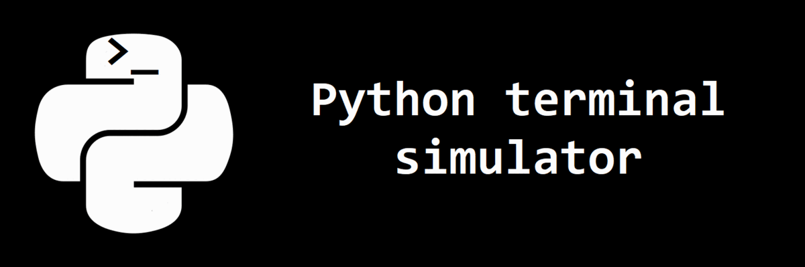

### PTS is a project that I made out of boredom and also as Python training.
### As the name says, it's a terminal simulation written in Python 3.11.
### It's currently able to create files and explore local directories, so it's not much. But I'm planning to add more stuff in the future.

##### pip requirements:
- os
- platform
- subproccess
- getpass

# License
[Unlicense license](LICENSE)
